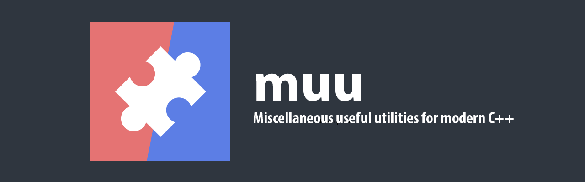

# ⚠&#xFE0F; this project is still in development and is not even remotely release-ready; please do not use it yet ⚠&#xFE0F;

  

[][cpp_compilers]

 ====

 

# What's inside

- todo

 

# Adding muu to your project

- todo

 

# Contributing
Contributions are very welcome! Either by [reporting issues] or submitting pull requests.
If you wish to submit a pull request, please see [CONTRIBUTING] for all the details you need to get going.

 

# License and Attribution

`muu` is licensed under the terms of the MIT license - see [LICENSE].

[API documentation]: https://marzer.github.io/muu/
[CONTRIBUTING]: ./CONTRIBUTING.md
[LICENSE]: ./LICENSE
[cpp_compilers]: https://en.cppreference.com/w/cpp/compiler_support
[reporting issues]: https://github.com/marzer/muu/issues
